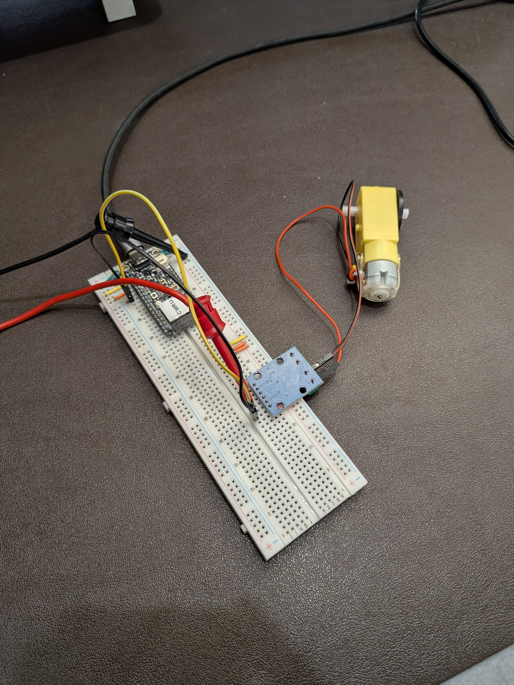
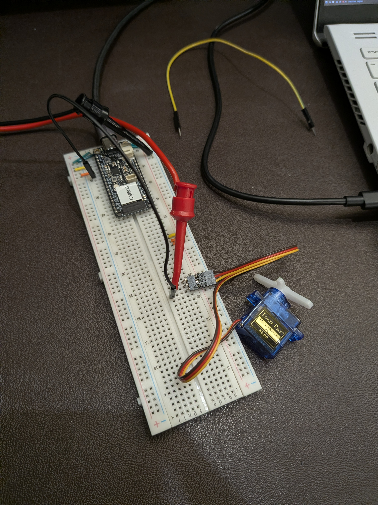

# Actuator Adventures

This is our third assignment working with the ESP32, and this lab focuses on connecting and controlling actuators.

## Process

### TT motor experimentation

- Changed the ouput values to pins A and B
- Found that setting pin a high makes it go counterclockwise, and B vise versa

### TT motor library

- Created a small library file for setting the speed of the TT motor
- Completed the assignment for clockwise and counterclockwise using this libary function
- For EC, used a sinusoidal on the time function in order to smoothly speed up or slow down the motor

### Servo experimentation

- The min and max pulse width set the limits for the positions on the servo
  - The smallest pulse means the lowest addressible angle same for the largest
  - If the range extends too far or too little, the end of the motion may be cut off or you may not reach the full range of motion
- Changed the period hertz, found that it changes how fast the location of the servo is updated
  - Setting it too high seems to make the locations inaccurate
- Changing the delay speeds up or slows down the speed of the rotation as a whole

### Servo development

- Generated a random angle, then mapped it to the PWM width in order for the servo to accurately move to the right position
- Generated another random number for the random amount of time until the next update
- For EC
  - Implemented the cubic smooth in/out function
  - Defined a servo location transition function
    - Takes old position, new position, transition time, and pulse width info
    - Maps the timing information from `micros()` into current angle
    - Maps angle into PWM information

## To run

- Update the `COMPILE_SECTION` definition in `constants.hpp` to select which portion of the project to compile, included comments state which section is which number
- Same as the other labs, simply run `pio run -t upload -t monitor` to build, upload, and watch the serial.

## Files

- `TT Motor.cpp`: Spins a TT motor back and forth
- `TT Motor Rotate.cpp`: Spins a TT motor back and force with waits
- `TT_motor_lib.cpp`: Simple library function for moving motor in a direction/speed with a single number
- `TT Motor EC.cpp`: Spins the TT motor smoothly along a sinusoidal, with a kick when its slow since it gets stuck
- `Servo Motor.cpp`: Spins a servo between 0° and 180° back and forth
- `Servo Motor Random.cpp`: Randomly moves a servo at random times
- `Servo_motor_lib.cpp`: Simple library for smoothly moving a servo from point A to B in a certain amount of time
- `Servo Motor EC.cpp`: Smoothly moves a servo at random times to random positions

## Reflection

This lab also took about ~2 hours, mostly spent on writing the code and fighting with cpp on random things, not at the fault of the lab. I would rate this as low difficulty and I still remain comfortable with the course content.

## Link to video and images

[https://youtube.com/shorts/qhzRcm9dfsw](https://youtube.com/shorts/qhzRcm9dfsw)

